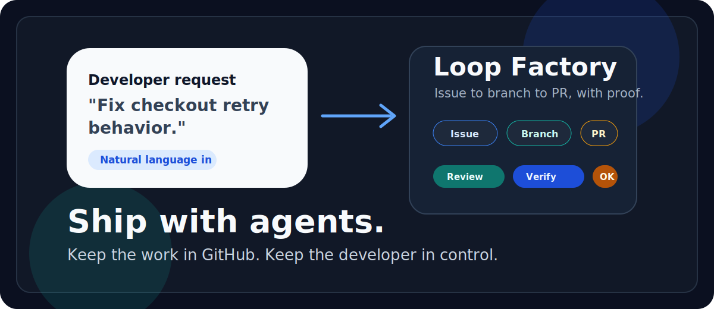
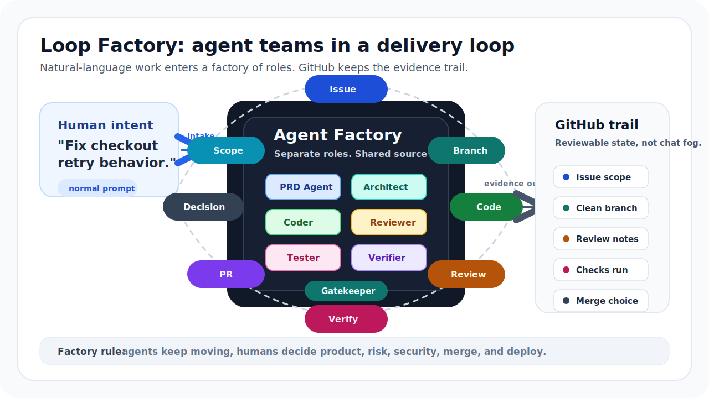

# Loop Factory

[](https://github.com/atomar1411/loop-factory)
[](LICENSE)
[](package.json)



Turn natural-language coding requests into reviewed, verified pull requests.

Loop Factory gives Codex, Claude Code, and other coding agents a simple delivery
loop: issue, branch, implementation, review, verification, pull request. Humans
stay in charge of product meaning, risk, merge, and deployment.

No dashboards. No hidden state. No special command to start normal work.

## Quickstart

From the project you want to enable:

```bash
npx --yes github:atomar1411/loop-factory setup --target .
```

After npm publication this becomes:

```bash
npx loop-factory setup --target .
```

For local plugin use before marketplace release, keep a stable checkout:

```bash
git clone https://github.com/atomar1411/loop-factory.git ~/.loop-factory
codex plugin marketplace add ~/.loop-factory
codex plugin add loop-factory@loop-factory-local
claude --plugin-dir ~/.loop-factory
```

Then open Codex or Claude Code in that project and speak normally:

```text
Fix checkout retry behavior and open a draft PR.
Create PRDs for onboarding before code changes.
Review PR #42, address comments, and verify the branch.
```

The agent should infer the loop, create durable task state when useful, work in
a clean lane, and report evidence.

## Why Loop Factory Exists

Coding agents are fast. Software teams are careful. Loop Factory connects those
two realities.

### #1: Work Disappears In Chat

**The problem.** A chat thread can contain the requirement, the plan, the test
output, the review, and the final decision. Then another agent starts with none
of it.

**The fix.** Loop Factory moves durable state into GitHub and the repo:

- issues for task scope,
- branches and worktrees for isolated changes,
- pull requests for review,
- checks and comments for evidence,
- `docs/truth/*` for project facts.

Private memory can help an agent think. It is not the source of truth.

### #2: Humans Become The Traffic Controller

**The problem.** The human ends up copying context between agents, asking which
tests ran, checking who touched what, and deciding whether vague progress claims
are real.

**The fix.** Loop Factory gives every task the same path:



The human gives direction, reviews important decisions, and controls merge or
deployment. The loop carries the coordination.

### #3: Agents Drift From The Requirement

**The problem.** A broad prompt becomes a broad patch. Files expand, scope
creeps, and review happens after the agent has already committed to the wrong
shape.

**The fix.** Loop Factory makes agents work from a task packet:

- objective,
- owned files or area,
- forbidden changes,
- required source-truth docs,
- verification gates,
- stop conditions.

If the task needs product or architecture judgment, the loop stops and asks.

### #4: "Done" Has No Evidence

**The problem.** Agents often say work is done without enough proof. Tests might
not have run. Logs might not have been checked. A browser flow might still be
broken.

**The fix.** Every meaningful task must report:

- changed files,
- commands run,
- pass/fail results,
- review findings,
- verification evidence,
- skipped gates,
- residual risk.

Evidence is part of the output, not an afterthought.

## What Gets Installed

Loop Factory bootstraps a target repository with reviewable operating files:

```text
AGENTS.md
CLAUDE.md
docs/agents/
docs/truth/README.md
.github/ISSUE_TEMPLATE/requirement.yml
.github/PULL_REQUEST_TEMPLATE.md
```

These files tell agents how to load context, when to create issues, how to use
worktrees, what evidence to report, and when to stop.

## How Agents Work

Loop Factory uses roles. A single runtime can perform several roles, but the
responsibilities stay separate.

| Role | Responsibility |
| --- | --- |
| Orchestrator | Splits work, creates task packets, routes agents, prevents overlap. |
| Issue Triager | Turns rough requests, bugs, and review comments into workable issues. |
| Product PRD Agent | Writes requirements, acceptance criteria, and non-goals. |
| Architecture Reviewer | Checks boundaries, contracts, diagrams, and source truth. |
| Implementer | Makes scoped source or documentation changes. |
| Reviewer | Reviews the diff against the task, docs, and evidence. |
| Verifier | Runs command gates and records pass/fail evidence. |
| Tester | Runs outside-in checks such as app startup, Docker, browser flows, logs, and DB inspection. |
| Gatekeeper | Enforces risk gates, autonomy level, evidence, and merge/deploy rules. |
| Release Manager | Coordinates release readiness, rollout notes, and cleanup. |

## Human Control

Agents can continue through routine implementation, review, and verification.
They stop before changing:

- product semantics,
- money movement,
- legal or compliance behavior,
- safety or data-loss behavior,
- security posture,
- deployment config or secrets,
- service boundaries,
- irreversible operations,
- merge or deploy state.

The point is not to remove humans. The point is to move humans to the decisions
where judgment matters.

## Tracking Work

GitHub is the default workbench.

- **Issues** hold the task and acceptance criteria.
- **Branches and worktrees** isolate implementation.
- **Pull requests** hold the diff, linked issue, review result, commands run,
  verification result, skipped gates, and residual risk.
- **Comments** carry review findings and decision requests.
- **Checks** carry repeatable validation.

A dashboard can be useful later. It should mirror GitHub and committed files,
not replace them.

## Install Details

Verify a bootstrapped project:

```bash
npx --yes github:atomar1411/loop-factory doctor --target /path/to/project --agent both
```

After npm publication:

```bash
npx loop-factory setup --target /path/to/project
npx loop-factory doctor --target /path/to/project --agent both
```

See [Installation And Setup](docs/installation.md) for the full setup path.

## Repository Layout

```text
.codex-plugin/          Codex plugin manifest
.claude-plugin/         Claude Code plugin manifest
agents/                 Claude Code plugin agent role prompts
assets/                 README images and diagrams
docs/                   Framework architecture and operating docs
packages/cli/           Bootstrap, doctor, and automation CLI
scripts/                Validation helpers
skills/                 Codex and Claude-compatible skills
templates/              Files copied into target repositories
examples/               Minimal target repo examples
```

## Reference

- [Natural Language Activation](docs/natural-language-activation.md)
- [Human Workflow](docs/human-workflow.md)
- [Installation And Setup](docs/installation.md)
- [Autonomous Loop Model](docs/loop-model.md)
- [Agent Roster](docs/agent-roster.md)
- [Architecture](docs/architecture.md)

## Status

Loop Factory is early. The current release is the foundation: plugin manifests,
skills, agent roles, repo templates, and a bootstrap CLI.

The promise is intentionally small: keep agent work in Git, keep evidence close
to the pull request, and keep humans in control of important decisions.
