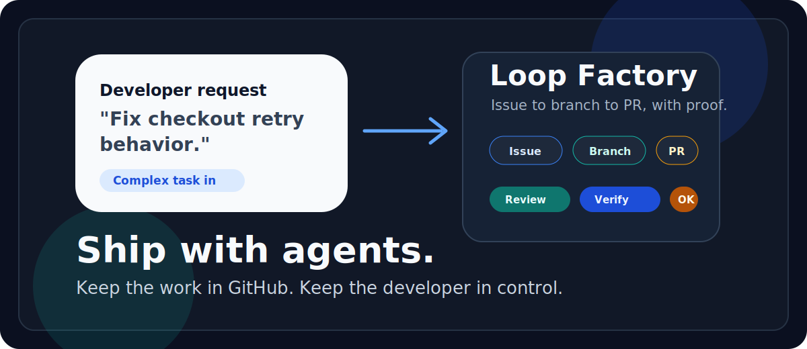
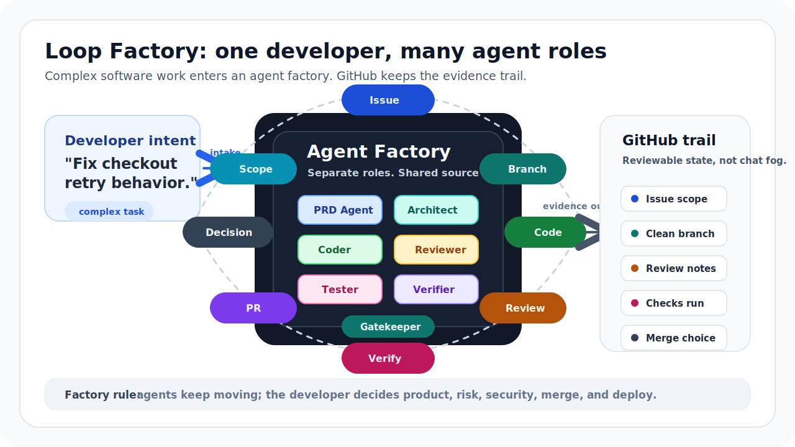

# Loop Factory

[](https://github.com/atomar1411/loop-factory)
[](LICENSE)
[](package.json)



Loop Factory helps developers use AI agents for real engineering work, not just
one-off code generation.

It turns a rough software request into a controlled delivery loop: scope the
work, create durable task state, isolate a branch or worktree, run specialist
agent profiles, review the diff, verify the result, and leave the evidence in a
pull request.

The developer stays in control of product meaning, architecture, risk, merge,
and deploy decisions. Agents handle the coordination work around them:
requirements, implementation, review, testing, verification, and release
readiness.

## The Core Idea

Loop Factory is built from two words: **loop** and **factory**.

### What Is A Loop?

A loop is a feedback cycle.

An agent should not take a vague instruction, disappear into a long edit, and
come back with "done." It should move through a short path where every step
creates evidence:

```text
request
  -> issue
  -> branch
  -> implementation
  -> review
  -> verification
  -> pull request
  -> developer decision
```

That is the loop.

The loop keeps the agent grounded. If the requirement is unclear, it creates an
issue. If the code changes, it runs verification. If the change touches product,
money, security, deployment, or architecture, it stops and asks.

### What Is A Factory?

A factory is a set of specialist profiles and handoffs.

One agent can write code. A developer shipping real software needs more than
that. They need help shaping requirements, protecting architecture, reviewing
diffs, running tests, enforcing risk gates, and preparing releases.

Loop Factory gives agents those profiles:

- **Orchestrator** splits work and prevents overlap.
- **Issue Triager** turns rough requests into workable tasks.
- **Product PRD Agent** writes requirements and acceptance criteria.
- **Architecture Reviewer** protects boundaries and source truth.
- **Implementer** changes scoped files.
- **Reviewer** checks the diff against the task.
- **Verifier** runs command gates.
- **Tester** checks the product from the outside in.
- **Gatekeeper** enforces risk, evidence, merge, and deploy rules.
- **Release Manager** handles readiness and cleanup.

That is the factory.

The factory does not mean a heavy process. It means the work has a place to go,
and every specialist knows what it owns.

### Why Put Them Together?

The loop gives agents feedback.

The factory gives agents coordination.

GitHub gives the developer an audit trail.

Together, they turn "please fix this" into a piece of software work you can
inspect, review, and trust.



## Use Cases

Loop Factory is for developers who want AI agents to help with serious software
work without losing control of the codebase.

Use it when you need to:

- coordinate coding agents across product, architecture, implementation,
  review, testing, verification, and release profiles,
- move complex feature work from requirement to GitHub issue, branch, reviewed
  pull request, and verification evidence,
- run Codex or Claude Code on a repo without burying task state in chat,
- keep AI code review, test automation, and PR evidence close to the work,
- use Git worktrees so parallel agents can work without stepping on each other,
- make agent output auditable before a developer decides to merge or deploy.

## Quickstart

Install Loop Factory once on your machine:

```bash
npx --yes github:atomar1411/loop-factory install
```

Then open Codex or Claude Code in the project you want to enable and run:

```text
/loop-factory
```

After npm publication:

```bash
npx loop-factory install
```

Verify a project when needed:

```text
/loop-factory doctor
```

After that, give Codex or Claude Code real software work:

```text
Fix checkout retry behavior and open a draft PR.
Create PRDs for onboarding before code changes.
Review PR #42, address comments, and verify the branch.
```

The slash command is for enabling and checking a repo. Normal feature, bug,
review, product, architecture, and cleanup work should flow from the request
itself.

## Why This Exists

Coding agents are fast. Software engineering still needs discipline.

Loop Factory exists to fix the common failure modes that show up when agents are
used on real projects.

### #1: The Agent Did The Wrong Thing

**The problem.** You gave the agent a hard task. It guessed the missing context,
touched too many files, and came back with a patch that sort of works but does
not match the intent.

**The fix.** The loop starts by turning rough intent into a task packet:

- objective,
- owned files or area,
- forbidden changes,
- required source-truth docs,
- verification gates,
- stop conditions.

If the agent cannot safely scope the work, it asks. If the task is too broad, it
splits it.

### #2: The Work Vanished Into Chat

**The problem.** The requirement, plan, review, and test output live inside one
conversation. Another agent cannot see it. The developer has to copy everything
around.

**The fix.** Loop Factory moves durable state into places software work already
lives:

- GitHub issues,
- branches and worktrees,
- pull requests,
- review comments,
- checks,
- source-truth docs.

Private model memory can help an agent think. It is not project truth.

### #3: The Developer Became The Project Manager

**The problem.** The developer has to ask what happened, which tests ran, who
touched which files, whether review happened, and whether the branch is safe to
merge.

**The fix.** The factory gives those jobs to specialist agent profiles. The
developer stays focused on the decisions that actually need judgment:

- product meaning,
- risk,
- architecture acceptance,
- merge,
- deployment.

The developer is not removed. The developer stops being the message bus.

### #4: "Done" Had No Evidence

**The problem.** Agents often say "done" without enough proof. Maybe tests ran.
Maybe they did not. Maybe the browser flow is broken. Maybe logs would have told
the real story.

**The fix.** Every meaningful task reports evidence:

- changed files,
- commands run,
- pass/fail results,
- review findings,
- verification evidence,
- skipped gates,
- residual risk.

If evidence is missing, the task is not done.

## What Gets Installed

Loop Factory bootstraps a target repo with files agents can read and the
developer can review:

```text
AGENTS.md
CLAUDE.md
docs/agents/
docs/truth/README.md
.github/ISSUE_TEMPLATE/requirement.yml
.github/PULL_REQUEST_TEMPLATE.md
```

These files tell agents how to load context, when to create issues, how to use
worktrees, what evidence to report, and when to stop.

## How The Developer Stays In Control

Agents can continue through routine implementation, review, and verification.

They stop before changing:

- product semantics,
- money movement,
- legal or compliance behavior,
- safety or data-loss behavior,
- security posture,
- deployment config or secrets,
- service boundaries,
- irreversible operations,
- merge or deploy state.

The goal is not to make the developer approve every small step. The goal is to
make agents stop at the places where being wrong is expensive.

## Tracking Work

GitHub is the default workbench.

- **Issues** hold task scope and acceptance criteria.
- **Branches and worktrees** isolate implementation.
- **Pull requests** hold the diff, linked issue, review result, commands run,
  verification result, skipped gates, and residual risk.
- **Comments** carry review findings and decision requests.
- **Checks** carry repeatable validation.

A dashboard can exist later. It should mirror GitHub and committed files, not
replace them.

## Install Details

Loop Factory keeps its CLI for CI, scripting, and automation. For normal
developer use, prefer the slash command in Codex or Claude Code.

See [Installation And Setup](docs/installation.md) for CLI backstops, CI usage,
and troubleshooting.

## Repository Layout

```text
.agents/                Codex local marketplace manifest
.codex-plugin/          Codex plugin manifest
.claude-plugin/         Claude Code plugin and marketplace manifests
agents/                 Claude Code plugin agent profile instructions
assets/                 README images and diagrams
docs/                   Framework architecture and operating docs
packages/cli/           Bootstrap, doctor, and automation CLI
scripts/                Validation helpers
skills/                 Public /loop-factory skill and private references
templates/              Files copied into target repositories
examples/               Minimal target repo examples
```

## Reference

- [Automatic Workflow Activation](docs/automatic-workflow-activation.md)
- [Developer Workflow](docs/developer-workflow.md)
- [Installation And Setup](docs/installation.md)
- [Autonomous Loop Model](docs/loop-model.md)
- [Agent Profiles](docs/agent-profiles.md)
- [Architecture](docs/architecture.md)

## Status

Loop Factory is early. The current release is the foundation: plugin manifests,
skills, agent profiles, repo templates, and a bootstrap CLI.

The promise is intentionally small: keep agent work in Git, keep evidence close
to the pull request, and keep the developer in control of important decisions.
